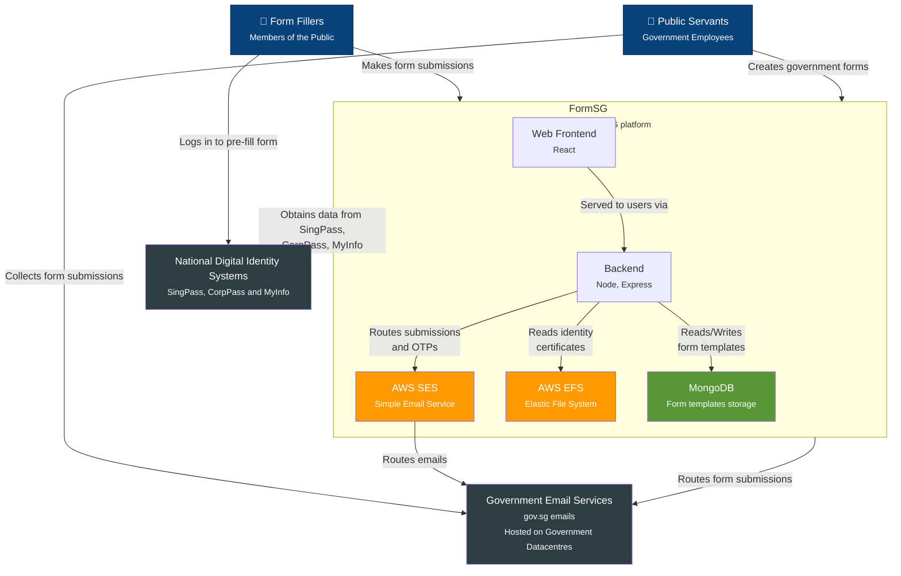
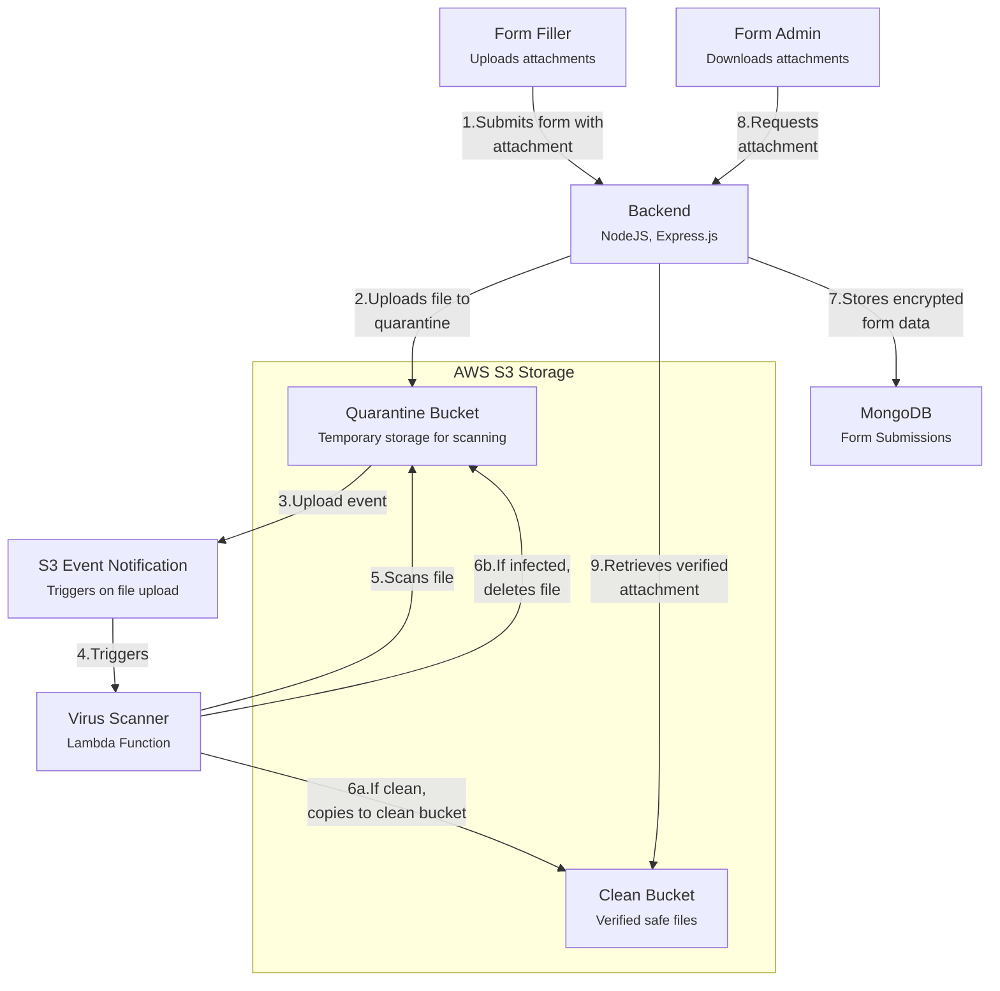

# Architecture

This article aims to give the reader an overview of FormSG's architecture,
relative to external systems and in terms of how the codebase is organised.

## System Architecture

FormSG runs on Amazon Web Services and is built on top of Express and React.
It relies on MongoDB Atlas, AWS EFS, and AWS S3 for storage, AWS SES to dispatch e-mails and
is deployed on Docker containers running on top of Elastic Beanstalk. Optionally, FormSG
can also talk to Government-hosted systems - SingPass/CorpPass/MyInfo to retrieve form-filler
identities, and E-mail servers hosted in Government Data Centres.

## Attachments and Virus Scanning

FormSG uses S3 buckets for storing form attachments with a serverless virus scanning process to ensure file safety.

<!-- TODO: this is just my assumption of how it works. have to deep-dive to code but haven't got around it -->

## Code Organization

### Backend

The backend for FormSG is bootstrapped using `src/app/server.ts` and `src/app/loaders`.
It sets up express.js routes defined in `src/app/**/*.routes.ts`, with business logic
defined in `src/app/**/*.controller.ts` and mongoose models defined in `src/app/**/*.model.ts`.

### Frontend

The frontend is written in React and can be found in `frontend/src`.

The index file is located at `frontend/public/index.html`. The frontend is built with CRA.

### Serverless Functions

FormSG uses serverless functions for operations that are separate from the main application flow:

#### Virus Scanner

Located in `serverless/virus-scanner/`, this Lambda function is responsible for scanning uploaded files for malware:

- Triggered by S3 events when files are uploaded to the quarantine bucket
- Uses ClamAV for virus detection
- Manages file movement between quarantine and clean buckets
- Integrates with AWS S3 via the `S3Service` for file operations
- Deployed using the Serverless Framework (serverless.yml)

#### GuardDuty Virus Scanner

Located in `serverless/virus-scanner-guardduty/`, this is an alternative implementation of the virus scanner:

- Similar functionality but with additional integration with AWS GuardDuty
- Uses tagging mechanisms to mark files as clean/infected
- Processes files based on authenticated API calls rather than S3 events
- Includes more comprehensive logging and error handling

### AWS Lambda Functions

Additional specialized Lambda functions are found in the `functions/` directory:

#### Form Payment Reconciliation

Located in `functions/form-payment-reconciliation/`, this Lambda function:

- Handles payment reconciliation for form submissions
- Generates reports for payment status
- Sends notifications to Slack for monitoring and alerts
- Can be deployed to various environments (prod, staging, uat) via CLI or manual upload
- Run on a scheduled basis to reconcile form payments
