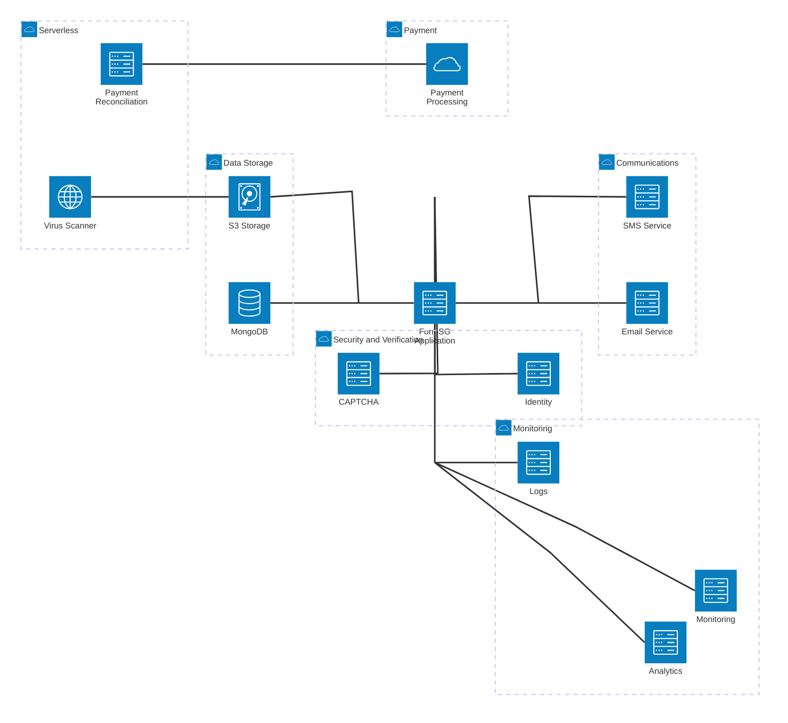

# Build Your Own Infra (BYOI)

This guide explains how to:
- Swap default integrations (e.g., AWS S3, SES, Twilio)
- Deploy FormSG in environments *without* AWS
- Configure airgapped or highly regulated setups

> **Tip:** You do not have to replace everything, these instructions are modular. Use what fits your context.

## Why BYOI? 🧩

FormSG was originally designed for AWS (ECR, S3, SES, etc.), but many teams:

- Require different cloud providers
- Have sovereignty or data residency requirements
- Want to run in regulated or airgapped environments

This section shows you where to start.

## ⚠️ Important Disclaimer ⚠️
> The FormSG team **will not be responsible for modifying, maintaining, or supporting custom deployments** or forks that replace default components (e.g., storage, email, authentication).
>
> You are welcome to adapt the project to suit your environment, but:
> - All such changes are your responsibility to maintain.
> - We can only provide general guidance or pointers via this documentation.
> - We do not guarantee compatibility, security, or support for third-party changes.
>
> **This guide exists to help you explore these options independently.**

## Modular Component Architecture
The following architecture diagram illustrates the modular components that make up a FormSG deployment.



The table below lists all the components used in FormSG and potential alternatives for custom deployments:

| Component | Default Implementation | Alternatives | Implementation Complexity |
|-----------|------------------------|--------------|---------------------------|
| **Database** | MongoDB Atlas | Self-hosted MongoDB, MongoDB-compatible databases | Medium |
| **File Storage** | AWS S3 | MinIO, Azure Blob Storage, Google Cloud Storage | Medium |
| **Email Service** | AWS SES | SMTP Server, SendGrid, Mailgun, Postmark | Low |
| **SMS Service** | Postman | Twilio, MessageBird, Vonage, local SMS gateways | Medium |
| **Analytics** | Google Analytics | Matomo, Plausible, Self-hosted analytics solutions | Low |
| **Spam Protection** | Google reCAPTCHA | hCaptcha, Self-hosted CAPTCHA solutions | Low |
| **Payment Processing** | Stripe | PayPal, Local payment gateways, Government payment systems | High |
| **Identity Verification** | SingPass/CorpPass | OAuth/OIDC providers, SAML-based identity providers | High |
| **Monitoring** | Datadog | Prometheus + Grafana, New Relic, AppDynamics | Medium |
| **Logging** | AWS CloudWatch | ELK Stack, Grafana Loki, Fluentd | Medium |
| **Virus Scanner** | AWS Lambda with ClamAV | Standalone ClamAV server, Containerized scanner, API-based scanning | High |
| **Payment Reconciliation** | AWS Lambda function | Scheduled cron job, Containerized worker, Manual process | Medium |

> *__Implementation Complexity Guide:__*
> * **Low**: Configuration changes only; minimal code changes required; typically takes a few hours to implement and test
> * **Medium**: Requires targeted code changes in specific modules; may involve creating adapters or wrappers; typically takes a few days to implement
> * **High**: Requires substantial refactoring across multiple modules; may involve changing core logic; typically takes weeks of developer effort and careful testing

Do note that the complexity measure is still a rough estimate.

### Database Alternatives

#### Migrating from MongoDB to FerretDB
[FerretDB](https://ferretdb.io) is an open source MongoDB alternative built on PostgreSQL. MongoDB can be swapped out of FormSG for FerretDB. In order for this to be done, certain changes to the code should be made as described below:

- Add postgres to the list of services in the `docker.compose` file e.g.
  ```  pg:
    image: postgres:15.3-alpine3.18
    environment:
      - POSTGRES_USER=<pguser>
      - POSTGRES_PASSWORD=<pgpassword>
      - POSTGRES_DB=<pgdbname>
    volumes:
      - pgdata:/var/lib/postgresql/data
    ports:
      - '5432:5432'
- In the same file, change the "database" image from MongoDB to FerretDB and update the database section to include the lines below:
    ```
     image: ghcr.io/ferretdb/ferretdb:1.17.0
     environment:
       - FERRETDB_TELEMETRY=disable
       - FERRETDB_POSTGRESQL_URL=postgres://pg:5432/formsg?user=<pguser>&password=<pgpassword>
     ports:
       - '8080:8080'
     depends_on:
       - pg
- Lastly, add the *pgdata* volume
    ```
        volumes:
            mongodb_data:
                driver: local
            pgdata:
- FerretDB currently has some limitations and [certain database features are not supported](https://docs.ferretdb.io/reference/supported-commands/), these include TTL, database transactions and some aggregration pipelines which are all features used by FormSG.

    The following changes can be made to mitigate the limitations of FerretDB:

    - Add the *autoRemove: 'interval'* property to the initializing of the session object in the `session.ts` file.
    - Remove the unsupported [aggregration pipeline stages](https://docs.ferretdb.io/reference/supported-commands/#aggregation-pipeline-stages) e.g. *lookup* and *project*, in the `submission.server.model.ts` file.
    - Replace the *findOneAndUpdate* code block in the `user.server.model.ts` file with code similar to the one below:
        ```
         const user = await this.exists({ email: upsertParams.email })
         if (!user) {
          await this.create(upsertParams)
        }
        return this.findOne({
          email: upsertParams.email,
        }).populate({...
#### Migrating from Mongoose ODM to Prisma ORM

FormSG uses Mongoose as the Object-Document Mapping (ODM) to MongoDB. This means that our code is strongly coupled with MongoDB as Mongoose solely supports it.

In order to use a different database with FormSG you will have to first migrate from Mongoose to other object modelling libraries. One of which is Prisma.

Prisma is an Object-Relational Mapping (ORM) library that can also be used as the object model for MongoDB. Prisma is compatible with various other relational databases like Cockroach DB.

Follow this [guide](https://www.prisma.io/docs/guides/migrate-to-prisma/migrate-from-mongoose#overview-of-the-migration-process) by Prisma to migrate from Mongoose.

The guide has 4 primary steps:

1. Install Prisma CLI
2. Introspect the current MongoDB for the data model
   1. For this section, Prisma’s introspection should be able to create prisma models that will replace your `server.model.ts` for each collection
   2. Additionally, as Prisma is relational, you could add relations between the various documents. One good relation to add will be `form` many to one `user` on the `[form.email](http://form.email)` field.
3. Install Prisma Client
4. Replace Mongoose Queries with Prisma Client
   1. This step will likely take the most refactoring efforts
   2. This will include most files in `formsg/src` ending with `service.ts`
   3. Including test files ending with `service.spec.ts`

##### Replacing MongoDB with CockroachDB

Thereafter, you could set up CockroachDB which is a distributed SQL DB. Follow the quick start guide by [CockroachDB](https://www.cockroachlabs.com/docs/cockroachcloud/quickstart) to create a CockroachDB Serverless cluster.

To replace the local development instance, you can follow this [guide](https://www.cockroachlabs.com/docs/stable/start-a-local-cluster-in-docker-mac). As FormSG uses Docker for local development, you will have to replace the `mongoDB` container from `docker-compose.yml` to the `cockroachDB` version.

Then connect to [CockroachDB](https://www.prisma.io/docs/getting-started/setup-prisma/add-to-existing-project/relational-databases/connect-your-database-typescript-postgresql) by changing the DB url in `.env` to the one from your CockroachDB `DATABASE_URL="YOUR_COCKROACH_DB_URL"`.

For local development, if the DB is replaced as above, you should not need to modify the ports as it will still be hosted on `localhost:27017`.

##### Other Prisma supported DBs

MongoDB can be replaced with other various relational databases supported by Prisma in this [list](https://www.prisma.io/docs/reference/database-reference/supported-databases).

#### Other potential DB migrations

It is also possible to migrate from Mongoose to [Ottoman](https://ottomanjs.com/), which is another ODM.

The process will be simpler than migrating to Prisma, but Ottoman is more restrictive and can only be used together with Couchbase, which is also a noSQL DB like MongoDB.

Refer to this [guide](https://www.couchbase.com/blog/migrate-mongodb-mongoose-couchbase-ottoman/) to migrate from Mongoose to Ottoman and then replace MongoDB with Couchbase.

## Notes & Caveats
Some features (e.g., SingPass) may not work outside SG.

If you disable analytics and monitoring, observability will be limited.

Always test upgrades in a staging environment.

## 🏢 Running On-Premise or Airgapped

FormSG can be deployed in **on-premise** environments or **airgapped networks** (with no outbound internet connectivity). This setup is common in highly regulated or sensitive environments.

> **Note:**
>
> Running airgapped will **require extra effort** to:
>
> - Mirror all container images to a private registry
> - Bundle and host all static frontend assets locally
> - Replace any integrations relying on external services (e.g., S3, SES, analytics)
> - Disable or mock outbound health checks and telemetry

**Your Responsibilities:**

- Verify you are not unintentionally leaking data via outbound calls.
- Regularly patch and update dependencies yourself.
- Test upgrades in a safe staging environment before production.

**Support Notice:**

The FormSG team **does not provide installation or operational support** for airgapped or fully custom on-prem deployments. We can only share general pointers and this documentation.
