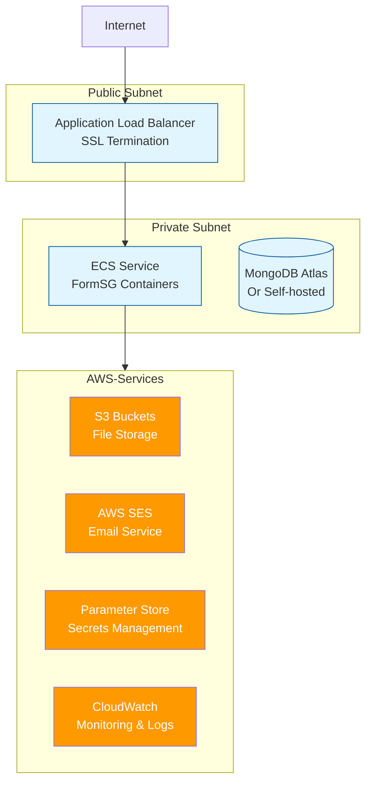

# 🚀 AWS Production Deployment

## Prerequisites

Before starting this deployment:

#### :nerd: Technical Prerequisites

* [ ] **AWS Account** with administrative access
* [ ] **Domain name** you control (e.g., forms.yourorg.gov)
* [ ] **SSL certificate** for your domain
* [ ] **Basic AWS knowledge** (IAM, EC2, networking concepts)
* [ ] **Docker and Git** installed locally

#### :scientist: Planning Prerequisites

* [ ] **Estimated user load** (concurrent users, forms per day)
* [ ] **Integration requirements** (email provider, identity system)
* [ ] **Security requirements** documented
* [ ] **Budget approved** for AWS infrastructure costs

#### 💰 Expected Costs

Costs vary significantly by region and usage patterns. For planning purposes:

**Small deployment (500 concurrent users):**

* Compute: $50-150/month (region-dependent)
* Database: $50-100/month
* Storage & networking: $20-50/month
* **Total range**: $120-300/month

Use the [AWS Pricing Calculator](https://calculator.aws/) for region-specific estimates.

## Deployment Architecture

This basic deployment uses **AWS best practices** for government workloads:




## Infrastructure Setup Checklist

These are not an exhaustive step-by-step tasks, but a brief checklist of things to do.

**Database Layer**



* [ ] M10+ cluster in same AWS region
* [ ] Network access configured for your VPC CIDR
* [ ] Database user with `readWrite` permissions
* [ ] Connection string saved to Parameter Store



* [ ] ECS service with persistent storage
* [ ] Replica set configuration for high availability
* [ ] Regular backup strategy implemented



<details>

<summary><strong>Networking Layer</strong></summary>

* [ ] **VPC with public/private subnets** ([AWS VPC Guide](https://docs.aws.amazon.com/vpc/latest/userguide/VPC_Scenarios.html))

- [ ] **Security Groups configured**:
  * **ALB Security Group**: Port 443 (HTTPS) from internet, Port 80 (HTTP) for redirect
  * **ECS Security Group**: Port 5000 from ALB security group only
  * **Database Security Group**: Port 27017 from ECS security group only

</details>

<details>

<summary><strong>Storage Layer</strong></summary>

* [ ] **S3 Buckets** ([S3 Setup Guide](https://docs.aws.amazon.com/AmazonS3/latest/userguide/GetStartedWithS3.html))
  * `your-org-formsg-attachments` - Form file uploads
  * `your-org-formsg-images` - Form builder images
  * `your-org-formsg-logos` - Organization logos
  * `your-org-formsg-static` - Static assets (optional)

- [ ] **Bucket policies** configured to restrict access to ECS service

* [ ] **Versioning enabled** for attachment buckets (backup)

</details>

<details>

<summary><strong>Email Service</strong></summary>

* [ ] **AWS SES domain verification** ([SES Setup Guide](https://docs.aws.amazon.com/ses/latest/dg/creating-identities.html))
  * Verify your government domain (e.g., yourorg.gov)
  * Request production access (removes sending limits)
  * Configure DKIM and SPF records
* [ ] **SES credentials** stored in Parameter Store

</details>

<details>

<summary><strong>Compute Layer (ECS)</strong></summary>

* [ ] **ECS Cluster** created with Fargate capacity provider

- [ ] **ECR Repository** for FormSG container images

* [ ] **Task Definition** configured (see below)

- [ ] **ECS Service** with auto-scaling and health checks

* [ ] **Application Load Balancer** with SSL certificate

</details>

<details>

<summary><strong>Configuration Management</strong></summary>

* [ ] **Parameter Store** for environment variables

- [ ] **Secrets Manager** for sensitive data (database passwords, API keys)

* [ ] **CloudWatch Logs** for application logging

</details>

### Infrastructure as Code

You can configure the above all via ClickOps (clicking through dashboard), or with a templated infrastructure-as-code.

We use [Pulumi](https://www.pulumi.com/) internally but can't share our production templates due to security reasons. Use your preferred IaC tool (CDK, Terraform, CloudFormation, Pulumi) to implement the checklist above.

### FormSG-Specific Configuration

#### Container Setup

**Build and Deploy FormSG Image**

```bash
# Clone FormSG repository
git clone https://github.com/opengovsg/FormSG.git
cd FormSG

# Build production image
docker build -t formsg .

# Tag and push to your ECR repository
docker tag formsg:latest YOUR_ACCOUNT.dkr.ecr.REGION.amazonaws.com/formsg:latest
docker push YOUR_ACCOUNT.dkr.ecr.REGION.amazonaws.com/formsg:latest
```

[**ECS Task Definition**](https://docs.aws.amazon.com/AmazonECS/latest/developerguide/task_definitions.html)**, minimally configured with**

* **Container**: FormSG image from your ECR repository
* **Port**: 5000 (internal container port)
* **CPU/Memory**: 1024 CPU units, 2048 MB memory (adjust based on load)
* **Environment**: Reference Parameter Store for secrets (DB\_HOST, SESSION\_SECRET, etc.)
* **Health Check**
* **Logging**: CloudWatch logs enabled for troubleshooting

## Deployment Validation

**Service Health**

* [ ] ECS service running with desired task count
* [ ] Target group shows healthy targets
* [ ] Application accessible at your domain
* [ ] Health check endpoint returns 200: `curl https://forms.yourorg.gov/api/v3/admin/forms`

**Functional Testing**

* [ ] **Admin Access**: Navigate to `https://forms.yourorg.gov`
* [ ] **Login Flow**:
  * [ ] Click "Login" → Enter government email → Check email for OTP
  * [ ] Validates: SES email delivery, Parameter Store secrets, database connectivity
* [ ] **Form Creation**: Create and publish a test form
* [ ] **Form Submission**: Test citizen submission and admin notification
* [ ] **File Upload**: Test attachment upload (validates S3 configuration)

**Monitoring Setup**

* [ ] Configure CloudWatch

***


**🎉 Success!** You now have a production FormSG deployment. Remember to monitor performance, apply security updates, and backup your data regularly.

