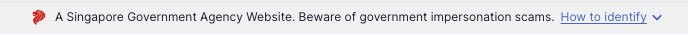
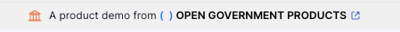

# ⚖️ Legal and Compliance

This document covers **legal and compliance requirements** you must follow when deciding to go to production with FormSG. Review these requirements as you progress through this guide.

### 🚫 Remove Singapore Government Branding :flag\_sg: <a href="#remove-singapore-branding" id="remove-singapore-branding"></a>

FormSG is open source, but **you must not use the official Singapore Government masthead or any associated branding** in deployments outside authorized Singapore Government contexts.

<figure><figcaption><p>Singapore government masthead.</p></figcaption></figure>

What you can do is **remove it completely,** or replace it with your agency branding. Here's an example of an alternative masthead

<figure><figcaption></figcaption></figure>

#### Starting Removal Checklist

**Frontend Components:**

* [ ] **Government Masthead**: Remove every usage of `<GovtMasthead />` . [Example](https://github.com/opengovsg/FormSG/blob/develop/frontend/src/app/PublicElement.tsx#L37).
* [ ] **VDP Report Button**: Remove `REPORT_VULNERABILITY` from `frontend/src/constants/links.ts`
* [ ] **Government Logos**: Remove .gov.sg logos from `frontend/public/static/img/`
* [ ] **App Metadata**: Update `frontend/src/constants/links.ts`, etc.

**Environment Variables:**

* [ ] **APP\_NAME**: Change from "FormSG" to your organization name
* [ ] **APP\_DESC**: Update description to reflect your organization
* [ ] **APP\_URL**: Use your organization's domain
* [ ] **APP\_KEYWORDS**: Remove Singapore-specific keywords
* [ ] **MAIL\_FROM**: Use your organization's email domain

**Singapore-Specific Services:**

* [ ] **SingPass References**: Remove SingPass authentication configuration
* [ ] **CorpPass References**: Remove CorpPass authentication configuration
* [ ] **MyInfo Integration**: Remove MyInfo data prefill configuration
* [ ] [**Postman**](https://postman-v2.guides.gov.sg/) **SMS**: Replace with your SMS service configuration

**Verification Script:**

This doesn't guarantee it will find every SG-tied code, but it's a decent simple starting script

```bash
# check frontend
grep -r -i \
    "singapore\|gov\.sg\|VDP\|vulnerability.*report\|singpass\|corppass\
  |myinfo\|masthead" \
    frontend/src/ \
    --exclude-dir={mocks,__tests__,__mocks__,assets} \
    --exclude="*.{stories,test,spec}.{ts,tsx}" \
    --exclude="*.svg" | nl


# also check backend
grep -r -i "gov\.sg\|singapore" backend/src/ \
  --exclude-dir={__tests__,__mocks__} \
  --exclude="*.{test,spec}.{ts,js}" \
```

It's basically a grep script that scans the codebase for occurrences of SG keywords. Here's a simple output as an example


```bash
# Example output
...
   182	frontend/src//features/admin-form/preview/PreviewFormPage.tsx:        <GovtMasthead />
   183	frontend/.../EditMyInfoChildren.tsx:import { SINGPASS_FAQ } from '~constants/links'
   189	frontend/.../EditEmail.stories.tsx:    allowedEmailDomains: ['@open.gov.sg'],
...
```


### Why This Matters

Using Singapore government branding without authorization could:

* Mislead citizens about your service's legitimacy
* Violate trademark laws
* Result in legal action

### What You MUST Do

If you fork or deploy FormSG:

* **Remove or replace the masthead** in all templates and front-end code
* Clearly indicate your deployment is _not_ affiliated with the Singapore Government
* Use your own branding and disclaimers

### Open Source License Compliance

#### MIT License Requirements

FormSG is licensed under the **MIT License**, which for you means

✅ **You CAN**: Use commercially, modify, distribute, use privately&#x20;

❌ **You MUST**: Include original license, maintain copyright notices&#x20;

⚠️ **You CANNOT**: Use FormSG trademark without permission

#### Third-Party Dependencies

FormSG includes many open source dependencies with various licenses:

**Dependency License Review**

* [ ] **Review package.json** - Check all dependency licenses
* [ ] **Document GPL dependencies** - Note any copyleft requirements
* [ ] **Commercial license conflicts** - Ensure no conflicts with your use
* [ ] **Export restrictions** - Check for encryption/export control issues

**License Audit Script:**

```bash
npx license-checker --summary --out licenses.txt
```

### Disclaimer and Liability

#### FormSG Project Disclaimer

FormSG is provided "AS IS" under the [MIT License](https://opensource.org/license/mit). The original developers:

* Provide no warranty or guarantee of fitness for purpose
* Are not liable for damages from your use of the software
* Do not provide commercial support or SLA guarantees

#### Your Deployment Responsibility

As the deploying organization, you are responsible for:

* **Security** - Proper configuration and hardening
* **Compliance** - Meeting all applicable laws and regulations
* **Support** - Helping your users and maintaining documentation
* **Operations** - Keeping the system running and updated

#### Recommended Legal Actions

Before deployment, confirm:

* [ ] All Singapore branding removed (run verification script as a sanity check)
* [ ] Your privacy policy covers form data collection
* [ ] You have incident notification procedures

***


**⚖️ Legal Principle**: You are responsible for ensuring your FormSG deployment complies with applicable laws, regulations, and organizational policies in your jurisdiction.

