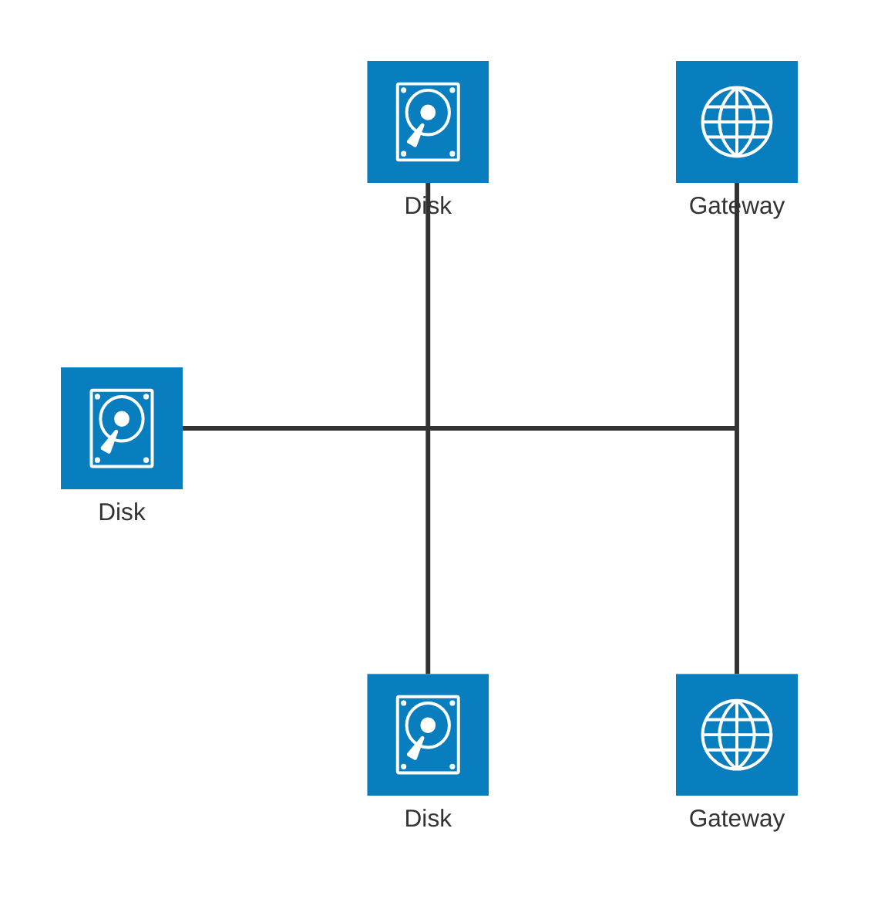
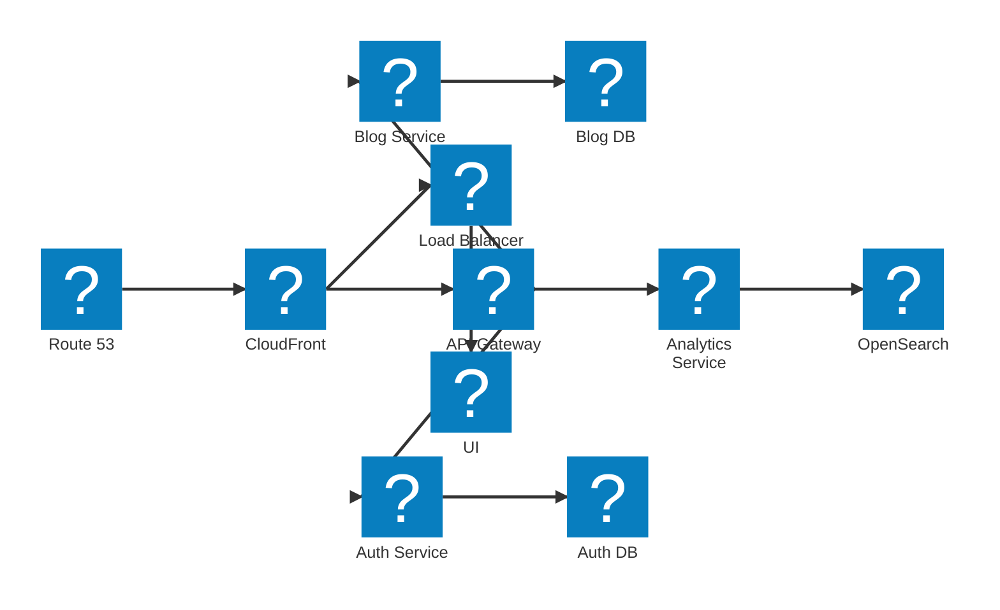

# beta mermaid stuff

https://mermaid.js.org/syntax/architecture.html

```mermaid
architecture-beta
    service left_disk(disk)[Disk]
    service top_disk(disk)[Disk]
    service bottom_disk(disk)[Disk]
    service top_gateway(internet)[Gateway]
    service bottom_gateway(internet)[Gateway]
    junction junctionCenter
    junction junctionRight

    left_disk:R -- L:junctionCenter
    top_disk:B -- T:junctionCenter
    bottom_disk:T -- B:junctionCenter
    junctionCenter:R -- L:junctionRight
    top_gateway:B -- T:junctionRight
    bottom_gateway:T -- B:junctionRight

```

https://medium.com/@koshea-il/architecture-diagrams-as-code-mermaid-vs-architecture-as-code-d7f200842712

```mermaid
architecture-beta
    service dns(logos:aws-route53)[Route 53]
    service cf(logos:aws-cloudfront)[CloudFront]
    service lb(logos:aws-ec2)[Load Balancer]
    service ui(logos:nextjs)[UI]
    service gateway(logos:aws-api-gateway)[API Gateway]
    service auth(logos:aws-lambda)[Auth Service]
    service authDb(logos:aws-dynamodb)[Auth DB]
    auth:R --> L:authDb
    service blog(logos:aws-lambda)[Blog Service]
    service blogDb(logos:aws-dynamodb)[Blog DB]
    blog:R --> L:blogDb
    service analytics(logos:aws-lambda)[Analytics Service]
    service analyticsIndex(logos:aws-open-search)[OpenSearch]
    analytics:R --> L:analyticsIndex
    dns:R --> L:cf
    cf:R --> L:lb
    lb:B --> T:ui
    cf:R --> L:gateway
    gateway:R --> L:auth
    gateway:R --> L:blog
    gateway:R --> L:analytics
```

<!-- for form -->
