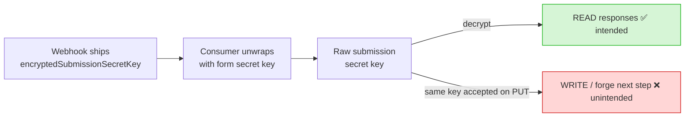
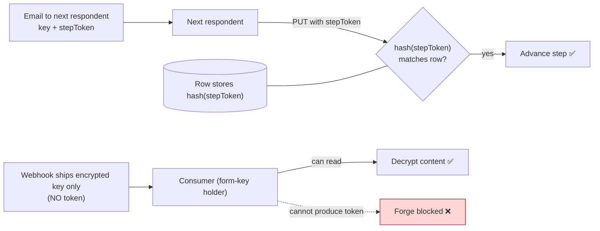
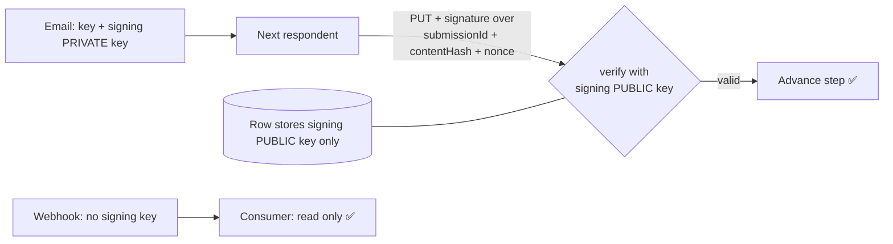
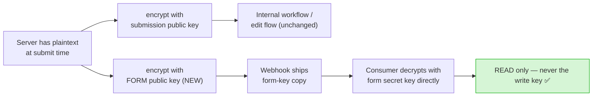

# Concerns regarding exposing SubmissionSecretKey in MRF v4 Webhooks

**Context**: Previously, we disabled the next-step submission link to prevent form admins who can see it from being able to submit the next step.

Putting `encryptedSubmissionSecretKey` in the webhook means any webhook consumer who **also holds the form secret key** can recover the raw submission secret key, and therefore can:

- **(a)** decrypt the submission
- **(b)** forge/submit the next workflow step as if they were the next respondent (unless the step has an authType enabled, e.g. SingPass or email/SMS field verification).

> **Why the key grants write, not just read.** The raw submission secret key is the *same* credential handed to the next respondent in their magic link (`?key=...`). The next-step `PUT` route has **no auth guard beyond rate limiting** — possession of the key + submissionId is the authorization. AuthType (SingPass/MyInfo), when present, only *stamps* the submitter's identity into verified content; it does **not** check that the submitter is the designated respondent. So on a form with no authType/verified field, the key alone = ability to advance the workflow.

**Webhook consumers = Form secret key owner** (this is the assumed trust model; "usually" true).

### Open questions

- **Q:** Do we assume it is safe for the Form Secret Key owner to be able to "forge" the next step (on a non-authType / no-verified-field form)?
  - Can be contained by the next step's authType (SingPass / MyInfo / email-OTP of the designated next respondent) if "anti-forge" is crucial.
- **Q:** Is this something we can accept long-term, if we cannot reverse it?
- **Q:** If we wish to reverse this "forging" ability, how do we do so? Will it require a large-scale migration later?
  - *Short answer:* Reversal is **not a data migration** — the at-rest schema barely changes. It is a **contract change** (what the webhook payload contains) + a **submission-flow change**. The cost is in coordinating SDK/consumer versions and the respondent edit-link flow, not in migrating historical rows.

---

## Suggested next steps (in increasing cost)

**1. Document-and-ship.** Ship webhook v4 as-is; loudly document that for MRF the form secret key is now a *workflow-advancement* credential, not just a read credential. Treat anti-forging as consumer responsibility.

**2. Minimize exposure.** Ship the field, but:
   1. Only include `encryptedSubmissionSecretKey` when the form actually needs it. *(Eval: likely all steps need it for decryption.)*
   2. **TODO:** ensure FormSG itself never logs the webhook body.
   3. **TODO:** verify the SDK signature covers the payload so a tampered/replayed body is detectable. *(Note: today the signature covers only `URI + submissionId + formId + epoch` — **not** the body. True for storage mode too; integrity currently rests on HTTPS.)*

**3. Long-term anti-forge reversal** *(Q: do we need this?)* — Decouple read from write. Change the model so that **decrypting content** and **advancing the workflow** are different credentials, so leaking the submission key only leaks *read*, not *write*. Bigger engineering effort. Options below.

---

## Possible approaches to achieve (3)

All four close the core risk: **a webhook consumer + form-secret-key holder can read, but cannot forge the next step.** They differ in *how*.

> **Key insight that shapes the options:** the webhook consumer is read-only, and MRF responses are **encrypted server-side** (the backend already holds the plaintext at submission time). So we are free to choose *what* the webhook ships — we are not forced to ship the submission key at all.

### Today (the problem)



*One credential, two jobs: the key that decrypts is also the key that authorizes the next step.*

---

### Option A — Separate bearer "step token"

Introduce a per-step random token, distinct from the submission key. Store only its **hash** on the row; put the token in the magic-link email; the next-step `PUT` must present it.



**Tradeoffs:** + general (works for non-auth steps); + small change. − new authz primitive (token generation, rotation on each step, re-issue on workflow loop-backs); − magic link still a bearer credential (email interception still = write — unchanged).

---

### Option B — Bind write to the next respondent's authenticated identity

For SingPass/MyInfo steps, additionally require the authenticated submitter's identity to **match** the designated next respondent (today auth only stamps identity, doesn't gate).

```
  PUT (SingPass step) ─► verify NRIC == designated next respondent ─► else reject
```

**Tradeoffs:** + strictly stronger for auth'd steps. − only covers auth-enabled steps (email-only steps still need another mechanism); − changes respondent flow; − doesn't help the exact case the Qn is about (forms with no authType).

---

### Option C — Asymmetric proof-of-possession (hardened token)

Like A, but the magic link carries a **signing private key**; the row stores the matching **public key**. The `PUT` carries a *signature* over the request, not a shared secret.



**Tradeoffs:** + server stores only a public key (DB read never yields write capability); + signature binds to the specific payload → also stops replay/tampering. − most client-side crypto of the token options.

---

### Option D — Don't ship the key at all; ship a form-key-decryptable copy ✅ *recommended*

Challenge the premise: the consumer only needs to **read**, and already holds the **form secret key**. So have the server also encrypt the content **directly to the form public key** (storage-mode/v2 style) and ship *that*. The webhook carries **no** submission key.



**Tradeoffs:**
- **+ No new authz primitive** — no token, no hash storage, no rotation, no workflow-loop edge cases. The write path is **completely untouched**.
- **+ No client change** — encryption is already server-side.
- **+ Simpler for consumers** — same decrypt path as storage-mode v2, then `adaptV4ToV1` for shape. (Pin the minimum SDK version that has `adaptV4ToV1`.)
- **+ Retry-safe** — retries store only the `submissionId` and rebuild the payload from the persisted row via `getWebhookView()`. Nothing secret/ephemeral lives in the queue.
- **− ~2× content storage** (a second at-rest copy under the form key, needed for retries).

---

## Comparison

| | New authz primitive | Closes "form-key holder can forge" | Also closes email interception | Client change | Write-path change |
|---|:---:|:---:|:---:|:---:|:---:|
| A — bearer token | yes (shared secret) | ✅ | ❌ | small | new gate |
| B — identity-bound | yes (auth match) | ✅ *(auth steps only)* | partial | medium | new gate |
| C — async proof-of-possession | yes (keypair) | ✅ | ❌ | medium | new gate |
| **D — drop field, form-key copy** | **none** | **✅** | ❌ | **none** | **none** |

**Recommendation for discussion:** Since consumers are **read-only**, **Option D** removes the risk by removing the field — no machinery added to safely ship a dangerous one. A / C / B only become relevant if a consumer ever needs to *write* (advance the workflow programmatically), which should be a deliberate, separately-authenticated API — never a leaked key.

---

## Side note (pre-existing, independent of the above)

MRF submissions are **one DB row updated in place** per step (all steps share one `submissionId`). So a *delayed webhook retry* of an earlier step re-reads the row and sends the **latest** step's state, not a faithful snapshot of the failed step. This is true today and is **not** caused by any option above. If per-step retry fidelity matters, the fix (per-step snapshot, or embed payload in the queue message) is a separate decision.
