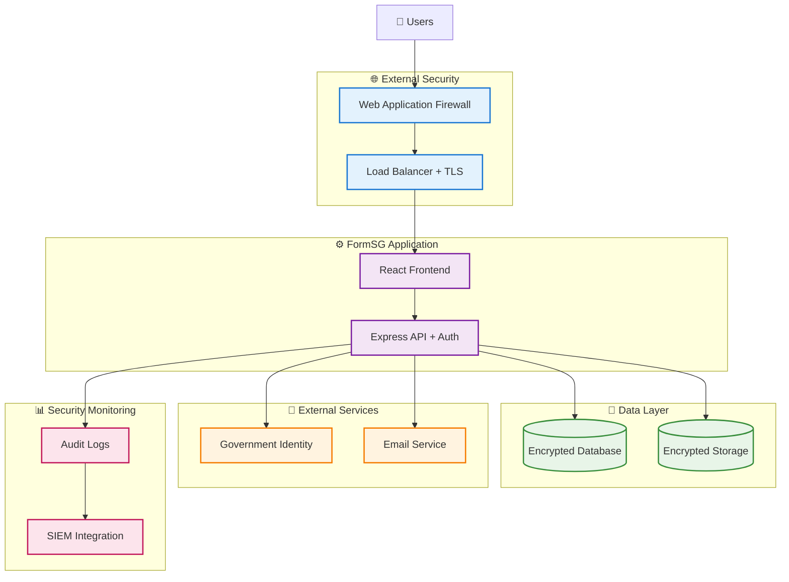
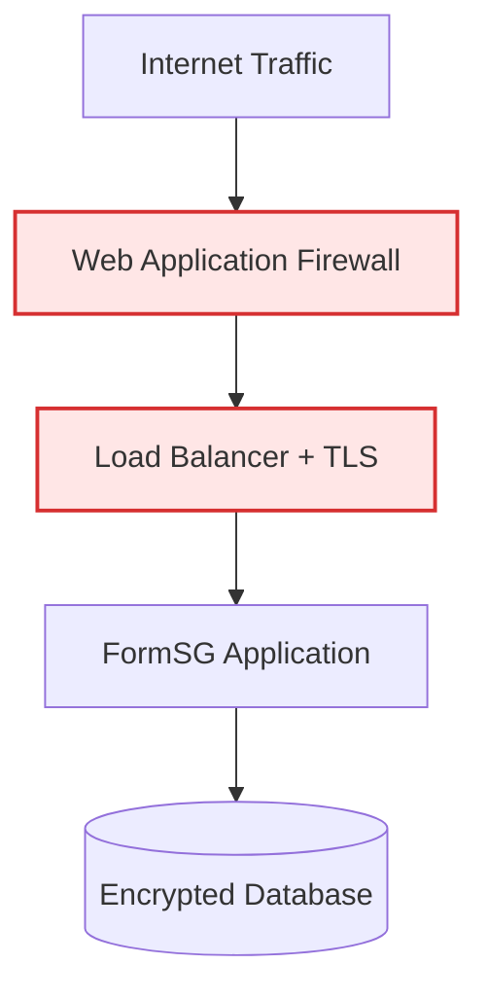
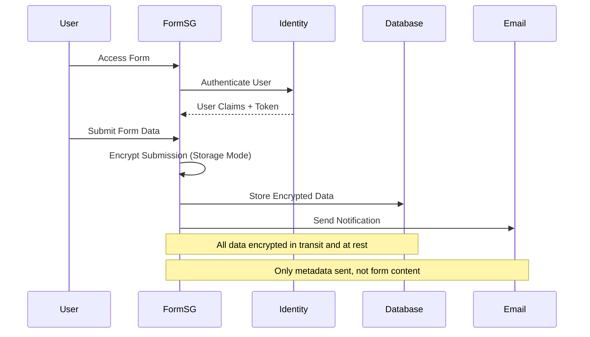

# 🛡️ Security

This document focuses on **FormSG-specific security considerations** for government deployments. It assumes your organization already has security expertise and established procedures - we focus on how FormSG integrates with your existing security framework.

## FormSG Security Architecture

FormSG implements several security patterns that enable secure government deployments:


{% column width="75%" %}












**Data Protection Layers**

* **Encryption in Transit**: TLS for all communications
* **Encryption at Rest**: Database and file storage encryption
* **End-to-End Encryption**: Storage mode forms use client-side encryption
* **Session Security**: Secure session management with configurable timeouts

**Access Control Model**

* **Role-Based Access**: Admin vs form creator permissions
* **Form-Level Security**: Per-form access controls
* **Authentication Integration**: Pluggable identity provider support
* **Session Management**: JWT with configurable expiration

#### Security-Relevant Architecture Decisions

Understanding why FormSG was designed certain ways helps you maintain security:

| Design Decision              | Security Benefit            | Customization Impact               |
| ---------------------------- | --------------------------- | ---------------------------------- |
| **3-Tier Architecture**      | Clear security boundaries   | Maintain network segmentation      |
| **Stateless API Design**     | Easier to scale securely    | Session store becomes critical     |
| **Component Modularity**     | Replace insecure components | Validate replacement security      |
| **Environment-Based Config** | No secrets in code          | Secure secrets management required |

## Data Flow

Understanding how data flows through FormSG helps secure integrations:



**Key Security Points**

1. **User authentication** happens before form access
2. **Form data encryption** occurs client-side (storage mode)
3. **Database storage** uses encrypted transport and storage
4. **Email notifications** contain only metadata, not form content
5. **Audit logging** captures all user actions

### Deployment Security Checklist

**Storage Mode Encryption:**

* [ ] **Client-side encryption keys** - `SIGNING_SECRET_KEY` and `VERIFICATION_SECRET_KEY` configured
* [ ] **Form data encrypted** - Submissions stored as encrypted content in database
* [ ] **Key separation** - Encryption keys stored separately from encrypted data

**Data in Transit:**

* [ ] **Database connections** - MongoDB connection uses TLS (`ssl=true` in connection string)
* [ ] **File storage connections** - Object storage API calls use HTTPS
* [ ] **Email connections** - SMTP connections use TLS (port 587/465)

**Data at Rest:**

* [ ] **Database encryption** - MongoDB/DocumentDB has encryption at rest enabled
* [ ] **File storage encryption** - Object storage has server-side encryption enabled
* [ ] **Secrets encryption** - Environment variables stored in encrypted secrets management

### Component Replacement Security

#### Email Service Security

When replacing AWS SES with your email service:

**Security Considerations**

* **SMTP Authentication**: Use app-specific passwords, not user credentials
* **TLS Encryption**: Ensure SMTP connection uses TLS (port 587/465)
* **Email Security**: Verify your email service supports SPF/DKIM/DMARC
* **Rate Limiting**: Configure appropriate rate limits for OTP delivery

**Email Security Validation Patterns**

**Connection Security:**

* [ ] **TLS encryption** - SMTP connection uses port 587 (STARTTLS) or 465 (SSL/TLS)
* [ ] **Authentication** - Use service account credentials, not personal accounts
* [ ] **App-specific passwords** - Use dedicated authentication tokens when possible

**Email Security:**

* [ ] **SPF/DKIM/DMARC** - Your email domain has proper email authentication
* [ ] **Rate limiting** - Email service has appropriate sending limits
* [ ] **Content security** - FormSG only sends notifications, not sensitive form data

**Example Configuration Pattern:**

```bash
# Secure email service configuration
SES_HOST=smtp.yourorg.gov  # Your organization's SMTP server
SES_PORT=587              # TLS port
SES_USER=formsg-service   # Dedicated service account
SES_PASS=[secure-token]   # App-specific password or token
```

#### Database Security

When using alternative MongoDB services:

**Security Requirements**

* **Encryption at Rest**: Database must support encryption
* **Network Encryption**: Connection must use TLS/SSL
* **Authentication**: Strong credentials with least privilege
* **Network Access**: Restrict database access to FormSG application only

**Database Security Validation Patterns**

**Connection Security:**

* [ ] **Encrypted connections** - Database connection string includes TLS/SSL parameters
* [ ] **Strong authentication** - Use dedicated service account with least privilege
* [ ] **Network access** - Database only accessible from FormSG application network
* [ ] **Connection validation** - Test database connectivity with your database client tools

**Data Protection:**

* [ ] **Encryption at rest** - Database service has encryption enabled
* [ ] **Access controls** - Database user has minimal required permissions
* [ ] **Audit logging** - Database access events logged for compliance

#### Object Storage Security

When replacing AWS S3:

**Security Features Required**

* **Server-Side Encryption**: Files encrypted at rest
* **Access Controls**: Bucket policies restrict access
* **Presigned URLs**: Temporary, time-limited file access
* **CORS Configuration**: Restrict cross-origin requests

**Object Storage Security Validation Patterns**

**Storage Encryption:**

* [ ] **Server-side encryption** - Storage service encrypts files at rest
* [ ] **Encryption in transit** - API connections use HTTPS
* [ ] **Key management** - Encryption keys managed by your security standards

**Access Controls:**

* [ ] **Bucket policies** - Only FormSG application can access storage buckets
* [ ] **Presigned URLs** - Temporary file access works with time limits
* [ ] **CORS configuration** - Cross-origin requests properly restricted
* [ ] **Public access blocked** - No public read/write access to form data buckets

### Security Monitoring and Logging

#### FormSG Audit Capabilities

FormSG provides several logging capabilities for security monitoring:

**Security Events Logged**

* **Authentication events**: Login attempts, failures, session creation
* **Form access**: Who accessed which forms when
* **Data modification**: Form creation, editing, deletion
* **Submission events**: Form submissions with timestamps and user context
* **Administrative actions**: User management, settings changes

**Security Monitoring Patterns**

**FormSG Audit Logging:**

* [ ] **Authentication events** - Login attempts, failures, session creation
* [ ] **Form access** - Who accessed which forms when
* [ ] **Data modification** - Form creation, editing, deletion
* [ ] **Administrative actions** - User management, settings changes
* [ ] **Submission events** - Form submissions with user context

**Log Configuration Pattern:**

```bash
# Enable comprehensive FormSG audit logging
LOG_LEVEL=info                    # Capture security-relevant events
CUSTOM_CLOUDWATCH_LOG_GROUP=/your/log/group  # Your log destination
```

**Security Monitoring Focus Areas:**

* [ ] **Failed authentication patterns** - Multiple failed logins from same IP
* [ ] **Unusual form access** - Access to forms outside normal patterns
* [ ] **Administrative changes** - Form modifications, user management
* [ ] **Submission patterns** - Unusual volume or timing of submissions

**Vulnerability Scanning Integration**

* **Container scanning**: Scan FormSG container images in your registry
* **Dependency scanning**: Monitor Node.js dependencies for vulnerabilities
* **Configuration scanning**: Validate FormSG configuration against security policies

### Compliance Support Features

#### Built-in Compliance Capabilities

FormSG provides several features that support government compliance requirements:

**Data Protection**

* **Encryption**: Client-side encryption for sensitive form data
* **Access controls**: Role-based access with audit trails
* **Data retention**: Configurable data retention policies
* **Data export**: Ability to export data for compliance reporting

**Audit and Accountability**

* **Comprehensive logging**: All user actions logged with timestamps
* **Non-repudiation**: Digital signatures for form submissions
* **Access tracking**: Who accessed what data when
* **Change management**: All form modifications tracked

**Privacy Protection**

* **Minimal data collection**: Only collect necessary form data
* **Consent management**: Form-level privacy notices
* **Data minimization**: Configurable field validation and limits
* **Right to deletion**: Data deletion capabilities for privacy compliance

#### Compliance Validation

**Compliance Validation Patterns**

**Data Protection Verification:**

* [ ] **Encryption validation** - Storage mode forms show encrypted content in database
* [ ] **Access control testing** - Users can only access authorized forms
* [ ] **Data retention** - Old submissions handled according to retention policies
* [ ] **Data export capability** - Compliance reports can be generated when needed

**Audit Trail Verification:**

* [ ] **Comprehensive logging** - All user actions captured in audit logs
* [ ] **Timestamp accuracy** - Log timestamps aligned with system time
* [ ] **User attribution** - Actions traced to specific user accounts
* [ ] **Change tracking** - Form modifications tracked with before/after states

***


**🔒 Security Principle**: FormSG provides security capabilities - your implementation and operational procedures determine the actual security of your deployment.

